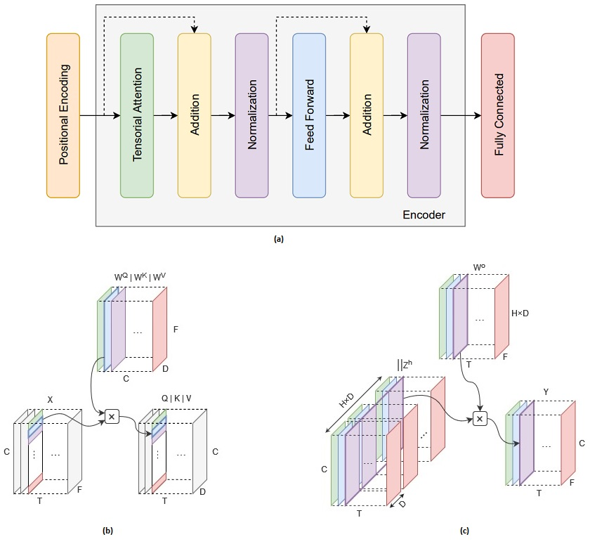
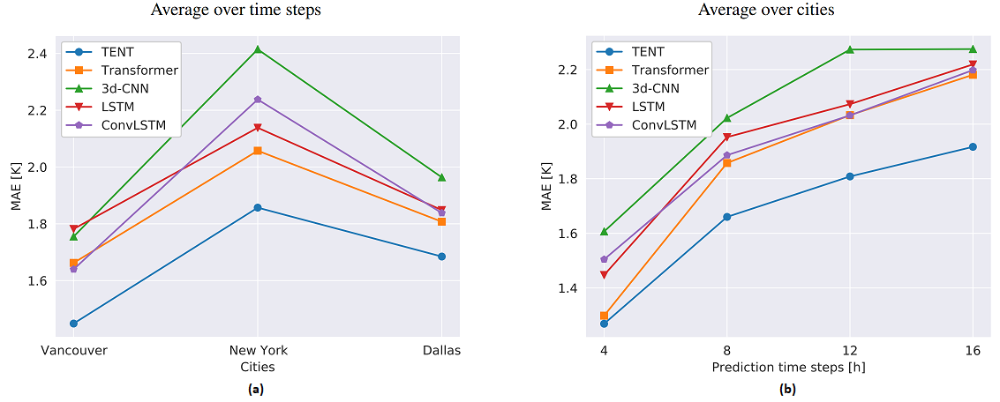
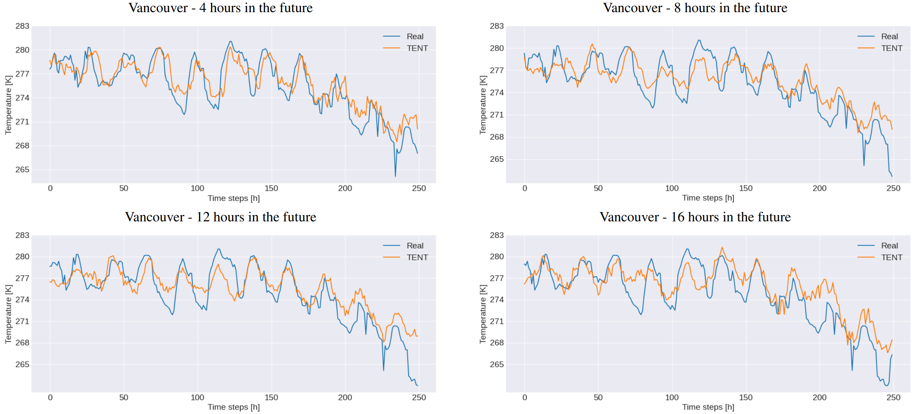

## TENT
Official implementation code of the paper: "TENT: Tensorized Encoder Transformer for temperature forecasting" [(ArXiv link)](https://arxiv.org/abs/2106.14742).

## Model architecture


(a) Model architectureTensorial. (b) Tensorial self-attention. (c) Tensorial multi-head attention.

## Results


The obtained test MAE of the models for USA-Canada dataset averaged over cities (a) and prediction time steps (b).


The comparison between the predictions of TENT model and the real measurements for hourly temperature of the test set of Vancouver.

## Attention visualization


Attention visualization for Vancouver in USA-Canada dataset.

## Data

In order to download the data, please email to the following addresses:

siamak.mehrkanoon@maastrichtuniversity.nl


## Usage
Execute the notebook on colab (Use TPU for TENT): [TT_All_models_experiments.ipynb](notebooks/TT_All_models_experiments.ipynb)

## Citation
If you use our data and code, please cite the paper using the following bibtex reference:
```
@article{bilgin2021tent,
  title={TENT: Tensorized Encoder Transformer for Temperature Forecasting},
  author={Bilgin, Onur and M{\k{a}}ka, Pawe{\l} and Vergutz, Thomas and Mehrkanoon, Siamak},
  journal={arXiv preprint arXiv:2106.14742v2},
  year={2021}
}
```

